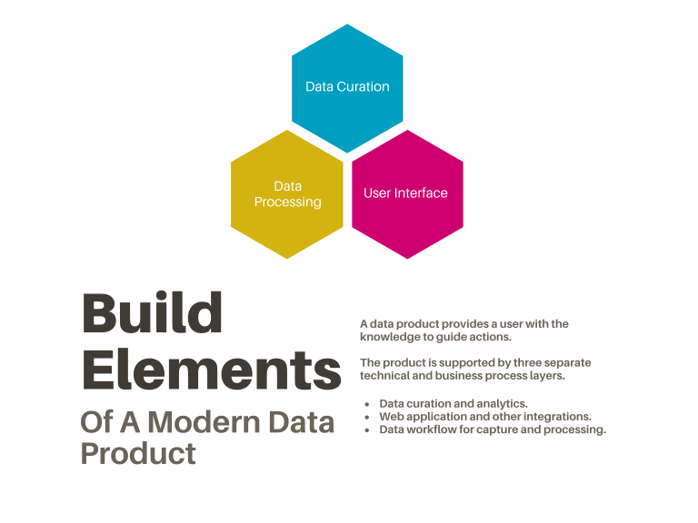

[TOC]

# The Modern Data Product Company

A data product company is a firm that provides a service to clients by easing the process of going from data to knowledge which informs actions. Data is the first element in a five step sequence to value known as the DIKAR model:

Data $\rightarrow$ Information $\rightarrow$ Knowledge $\rightarrow$ Action $\rightarrow$ Results

A data product company takes data and transforms the data into information. The information should be presented in such a way that it easily produces knowledge for the user.[^1] The goal of a data product company is to efficiently move from data to the conditions for knowledge acquition in the user base. For a data product with a subscription fee, users are synonomous with clients.[^2]

[^1]: 
    An AI-product company, by comparison, takes data and produces actions. An AI system creates a closed-loop system where results are measured and fed back into the system as data. Where your product stops along the DIKAR chain determines the type of firm.

    1. Data: storage
    2. Information: analytics
    3. Knowledge: education
    4. Action: recommendations
    5. Results: automation

    A data product company is one that derives its value proprosition as a function of data. A statistic, formally defined, is a function of a sample. Thus, an analytics company is a data products company and vice versa.

[^2]: N.b. For a firm like Facebook, the user base and paying customer base are not the same. Facebook users are advertisers, and the people that use the Facebook application are human chattel.

A data product is a combination of three elements:

1. Data Processing
2. User Interface
3. Data Curation

Data curation[^4] carries its own unique status in this case, because data has an abstract value above and beyond the technical details of the systems that store it and the measurement schemes used to create records.

[^4]: Absent curation, a company is a data _storage_ company and not a data _product_ company.

## Definitions
### Global Definitions

The most critical terms of data product companies are:

Business Logic
:  the technical elements of a system that provide unique value to users and/or customers.

Business Purpose
: specific processes for value creation.

Business Case
: a seperable domain of one or more business purposes which define value for users.

User
: someone who derives value from the use of data. Typically a human, though, can be a post-human automated process either as a part of, or separate from, the simulation.

Client
: the computer driven interfacing tool for the humans. Occasionally used with a different meaning to indicate a paying customer of some sort who is supposed to be getting value from data.

Value
: utility, with a homomorphism to USD, derived from providing goods or services that ameliorate the human condition. A data product must provide value to users, which is captured by the business as revenue and, ideally, profit.

### Roles

Data Owner
: accountable for data quality and fitness.

Data Steward
: responsible for data quality and fitness. Alternate titles: Custodian, Curator, Data Mangement Head, Bill.

Data Engineer
: responsible for the technical implementation of data curation

Data Scientist
: responsible for implementation of business logic from data

Database Administrator
: responsible for the deployment and maintenance of storage mechanisms.

Software Engineer
: responsible for building applications.

DevOps Engineer
: responsibile for deploying applications and infrastructure in a infrastructure-as-code model. Responsible for both customer facing tools, and supporting development tools for engineers and data scientists.

```cpp
//TODO: add roles for infrastructure, software engineering, project management, other things.
```

### Data terms

Datum
: a quantified record.

Data
: the plural of datum. Both data and it's singular form are defined by context and are renormalized by scale. For example, the fact that characters have a byte code which defines how the character is stored in a digital file is immaterial for consideration of a whole document analysis of sentiment.

Data set
: A collection of records (or subset of a larger collection) utilized for finding information.

Record
: an observation of the world as a quantified measurement. This is inclusive of digital textual records.

Source(s) of records
: both the technical and institutional source from which records are captured.

Resource
: synonm for source of records, but can be inclusive of things that are useful, but don't produce records.

Data retrieval
: accessing data by means of a query from storage.

Content
: all data is content and all content is data.

Data set status
: the current useability and availability of a given data set, according to a trinary logic of medal status.

Bronze
: Data is available, but experimental, exploratory, and unverified and undocumented.

Silver
 : Data is available, documentation is somewhat available, and the process of preparing it for final storage in a production-worthy context has begun.

Gold
: Data is available, fully documented, and available for production use.

Publication
: when a dataset is available for query by a production system.

Registry
: a recording of the metadata and derived charateristics of a set of records, but not of the records themselves.

Repository
: a storage mechanism for record sets.

Index
: a registry element designed to aid retreivel of records from a repository. A registry, with an index, combined with a repository makes a database.

### Storage Architectures

Storage
: refers to both the abstract and tangible elements of storing records. The type of storage is defined by the business case and logic.

Database (general)
: where a collection of records is kept for querying.

Database (technical)
: a software solution for storing records for fast querying. Includes specific tools like PostgreSQL, Neo4j, MongoDB, etc..

Archive
: a complete and final collection of records from a source.

Data warehouse
: a federated or consolidated system and location of multiple collections of records. A form of "Cold Storage."

Data Lake
: a loosly consolidated, federated, or completely heterogenous collection of records accessible via multiple retreival mechanisms. A form of "Cold" or "Lukewarm" storage.

### Types of storage

Hot Storage
: queries return data in human-scale time durations. Typically under five seconds.

Cold Storage (alternate adjective Lukewarm)
: queries return data in slower time frames. Can be a data lake or data warehouse, depending on the speed of queries and the degree of integration between records and sources, schematically.

Deep Freeze storage
: where final copies for later audit are stored. Last stop before deletion in a data lifecycle.

### Data Processing

Ingest
: all technical and business processes up to, but not including, analytics for a business purpose.

Capture
: the process where batches of records are brought into a collection of records from an external source.
    - Alternate: extraction in an Extract-Transform-Load (ETL) model.[^3]

[^3]: This nomenclature is to be avoided if the data product is using text documents, as you have two senses of the word "extract" in that case. In an ETL, you are capturing the data by "extracting" it from the data store where you initally find it. With NLP work, you also need to "extract" the text from a document for processing. In the latter case, this occurs during pre-processing.

Transformation(s)
: any data cleaning, repackaging, indexing, validation, verification, or quality assurance that occurs before a critical business logic. Alternate term: pre-processing.

Trigger
: both the conditions under and the mechanism for a registered data capture event.

## Data Curation Projects

In a pure data management scenario, data curation is the lifeblood of the work to be done. Fundamentally, it is about setting the choice of records to be curated with the data owner, and then appropriately documenting the source(s). This is, at its core, not a technical enterprise. However, one will often find themselves engaging in deeply technical work to support a data set. This is due to either: a lack of earlier investment of energy; or unforseen challenges with a particular dataset. As much as possible the technical elements of processing and publishing data should be established in advance of a data curation project.

- Identification
    - data owner confirms choice(s) of data set (or content sets, generally)
    - steward and owner agree upon publication requirements
- Validation
    - Steward confirms fitness for purpose with sample(s)
- Archiving
    - Historical data ingestion, processing, integration, and storage
- Capture
    - create a reoccuring or triggered process for new records
- Processing
    - prepare data for analysis (pre-processing)
    - run business logic against prepared data, post-capture
- Publication
    - store data for retreival
    - confirm necessary documentation available
    - data owner confirms the status of data and publication mechanisms

///Footnotes Go Here///
